# Work Phase 流程图

---

## 1. 完整日循环流程图

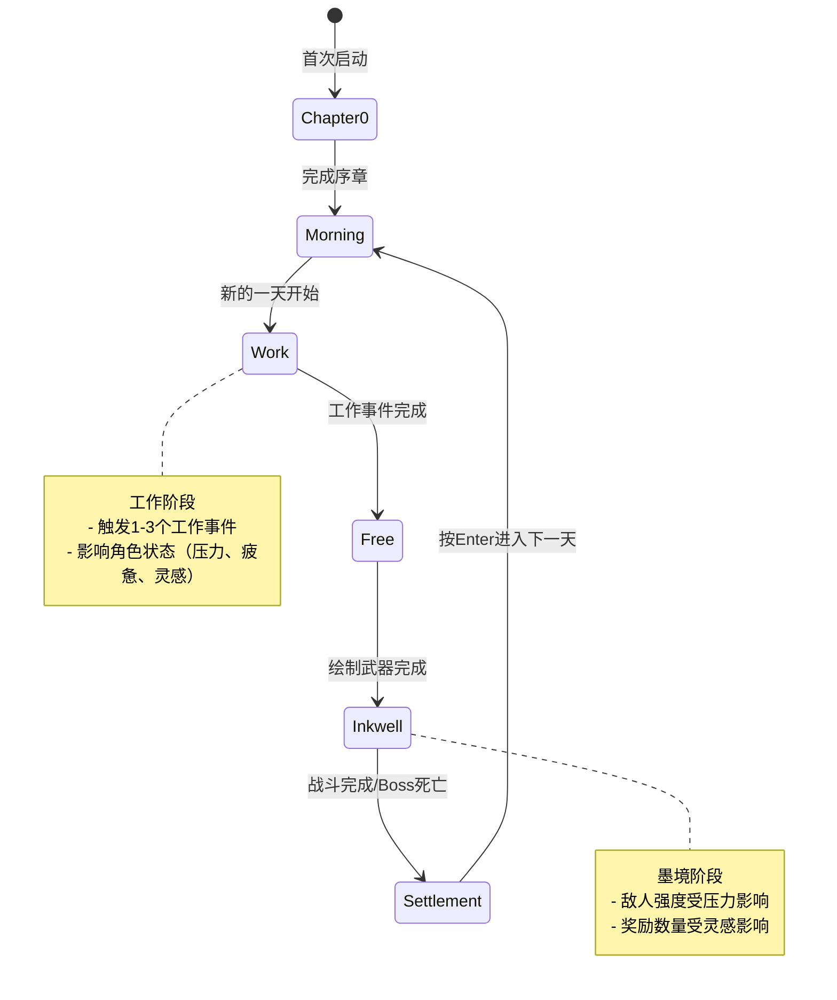

---

## 2. Work Phase 详细流程图

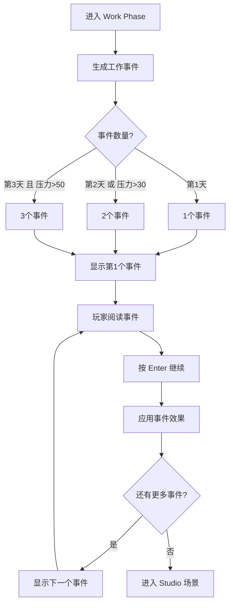

---

## 3. 工作事件系统流程图

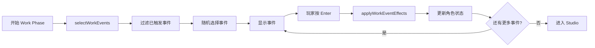

---

## 4. 状态对墨境的影响流程图

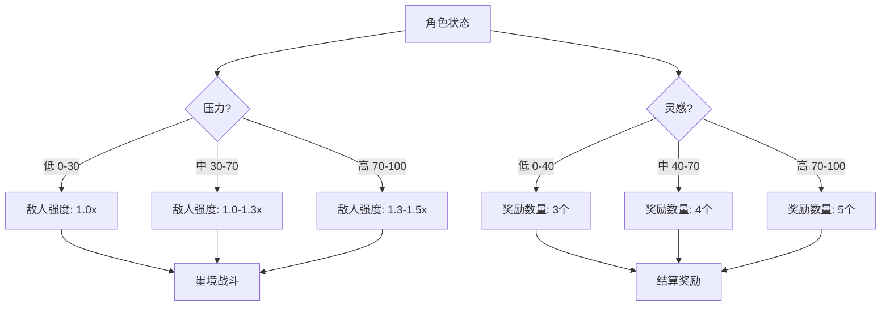

---

## 5. 事件类型与效果流程图

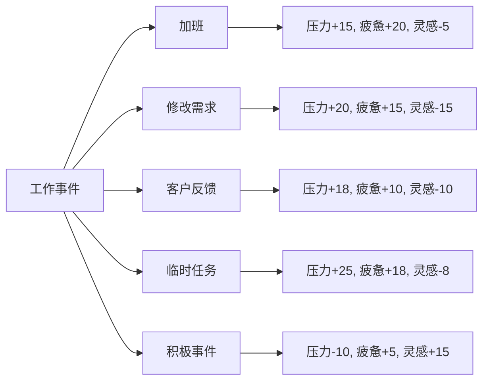

---

## 6. 核心主题流程图

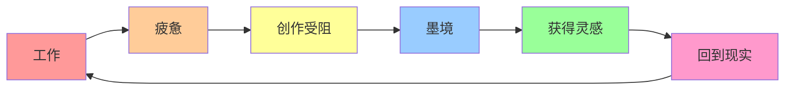

**颜色说明**：
- 🔴 工作（红色）- 压力和疲惫积累
- 🟠 疲惫（橙色）- 状态下降
- 🟡 创作受阻（黄色）- 灵感枯竭
- 🔵 墨境（蓝色）- 战斗和探索
- 🟢 获得灵感（绿色）- 状态恢复
- 🔴 回到现实（粉色）- 循环继续

---

## 7. 场景转换流程图

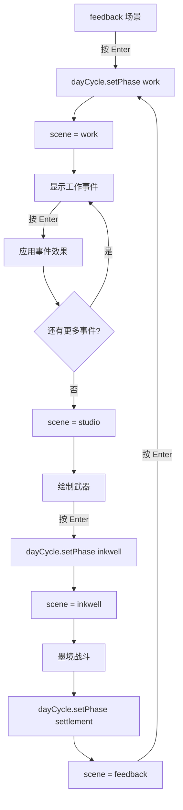

---

## 8. 事件选择逻辑流程图

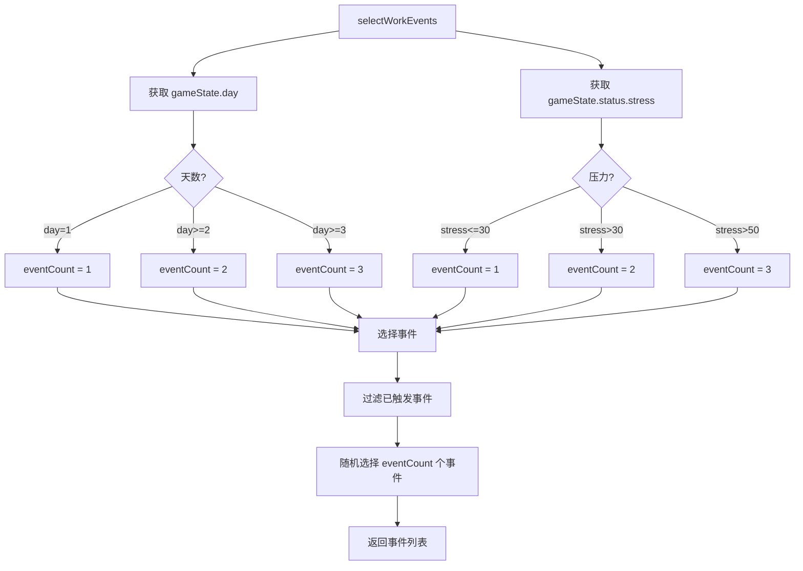

---

## 9. 压力对敌人强度的影响流程图

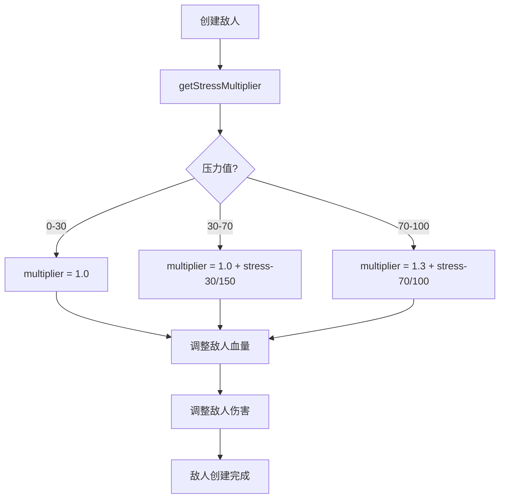

---

## 10. 灵感对奖励的影响流程图

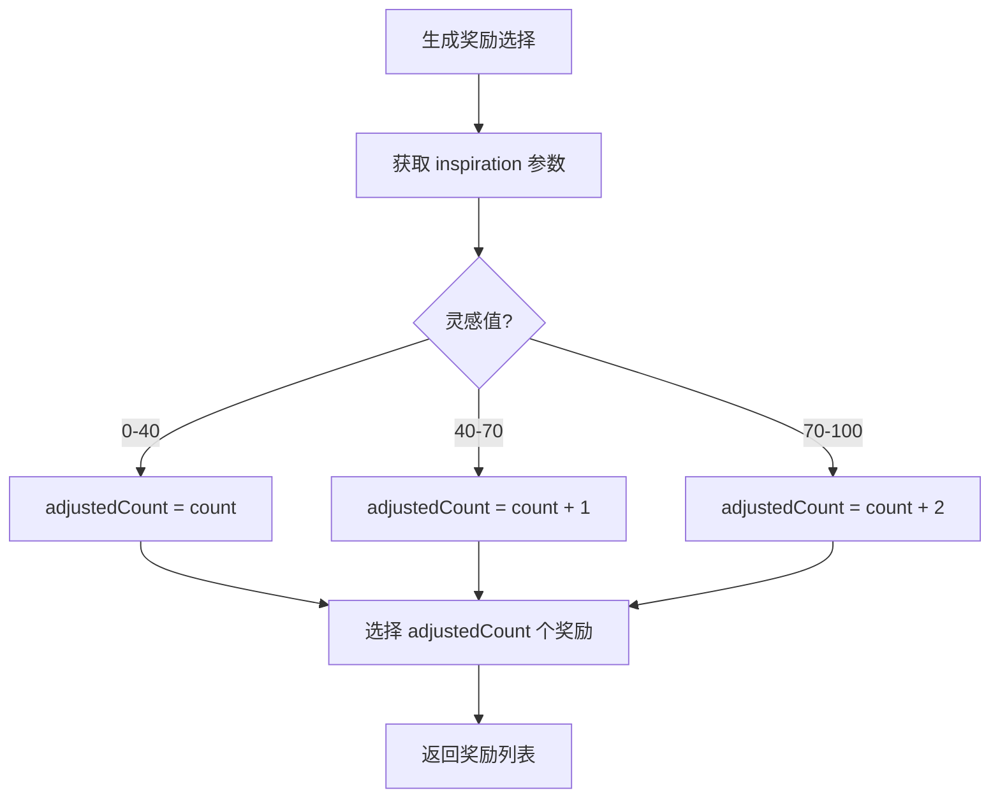

---

## 11. 文本流程图（简化版）

```
═══════════════════════════════════════════════════════════
  墨水深渊 - 完整日循环（含 Work Phase）
═══════════════════════════════════════════════════════════
  │
  ▼
[morning] ─── 新的一天开始
  │  day++, phase = "morning"
  │
  ▼
[work] ─── Work Phase（工作阶段）← 新增
  │  触发 1-3 个工作事件
  │  事件类型：加班、修改需求、客户反馈、临时任务
  │  状态影响：压力↑、疲惫↑、灵感↓
  │  按 Enter 继续，所有事件完成后进入 studio
  │
  ▼
[studio] ─── 绘制武器
  │  在工作室画布上绘制武器
  │  工具：Pencil / Eraser / Undo / Redo / Clear
  │  录入：笔划过程 → 形态分析 → 武器分类 → 属性生成
  │  Enter：完成绘制，进入墨境
  │
  ▼
[inkwell] ─── 墨境探索
  │  90 秒夜间倒计时
  │  ★ 压力高时敌人增强（血量 + 伤害增加）
  │  移动 (A/D)、跳跃 (Space)、二段跳、冲刺 (Shift)
  │  攻击 (左键)、挖掘、放置纸块 (右键)
  │
  ▼
[Boss 战]
  │  随机 Boss 变体
  │  Boss 死亡 → 返回传送门出现
  │
  ▼
[settlement] ─── 结算
  │  早晨反馈画面
  │  ★ 灵感高时奖励增加（奖励选择数量 +1 或 +2）
  │  显示：Day X / Boss 反馈 / Inkdot 状态
  │  奖励：遗迹选择、武器经验、武器进化
  │  Enter：进入下一天
  │
  ▼
[morning] ─── 循环继续
```

---

## 12. 文件依赖关系图

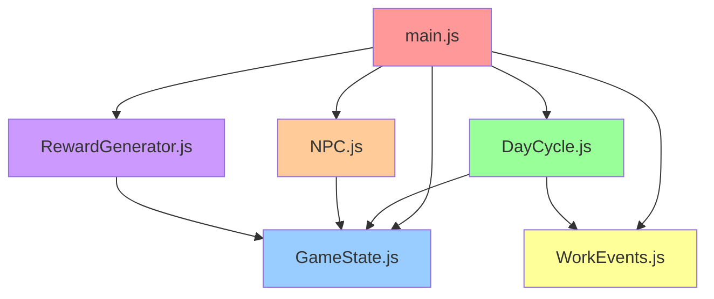

**说明**：
- `main.js` 是主入口，依赖所有其他模块
- `DayCycle.js` 依赖 `GameState.js` 和 `WorkEvents.js`
- `NPC.js` 和 `RewardGenerator.js` 依赖 `GameState.js` 来读取状态

---

## 13. 总结

以上是 Work Phase 的流程图，包括：

1. **完整日循环流程图** - 显示所有阶段的转换关系
2. **Work Phase 详细流程图** - 显示工作事件的处理流程
3. **状态对墨境的影响流程图** - 显示压力和灵感如何影响游戏
4. **核心主题流程图** - 显示"工作 → 墨境 → 回到现实"的循环
5. **场景转换流程图** - 显示场景之间的转换逻辑
6. **文本流程图** - 简化的文本版本，便于快速理解

这些流程图可以帮助理解 Work Phase 的设计和实现。
